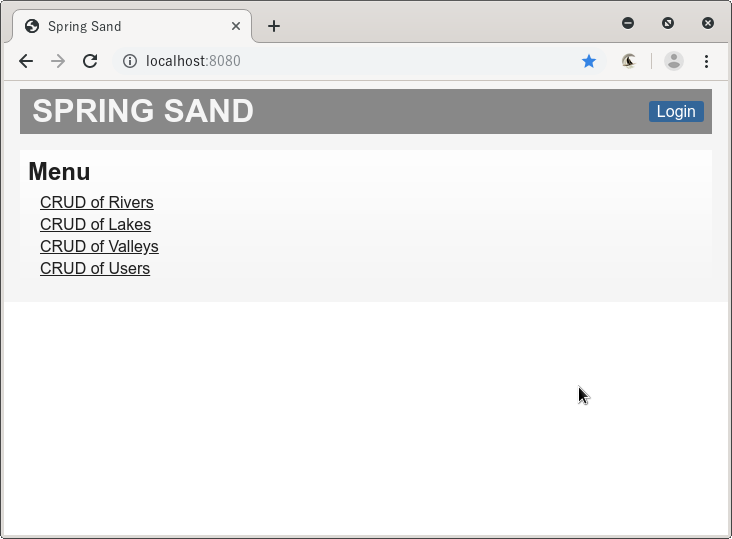
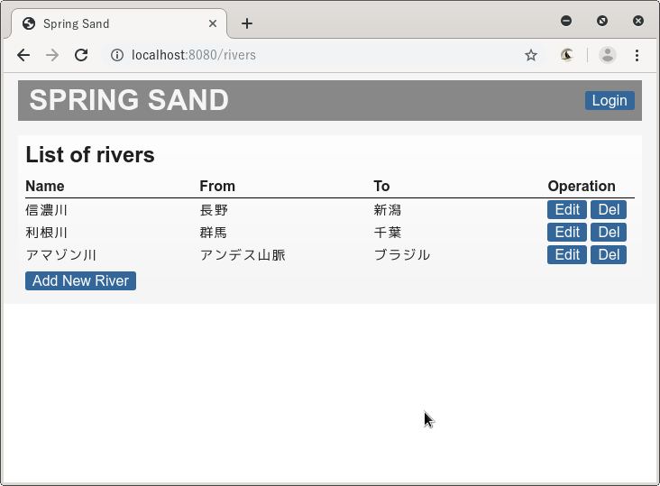
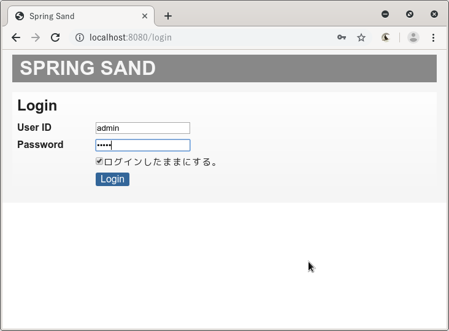
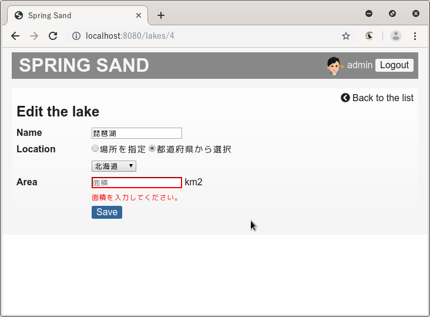
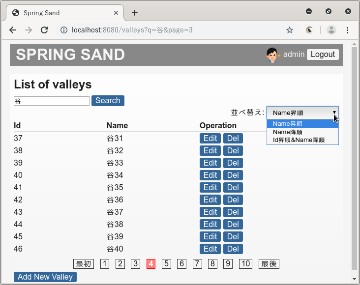
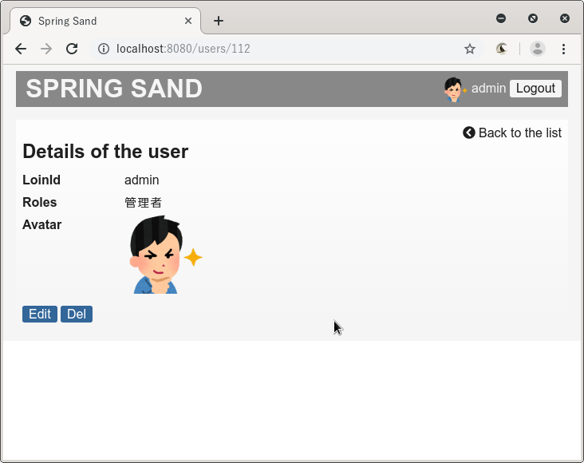
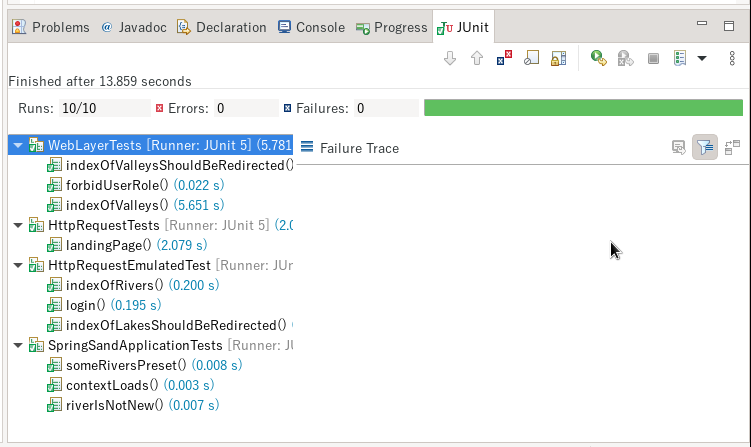

<!--
_header: ''
_class : lead invert page-center img-right-bottom
-->

# Spring Sand <!-- fit -->

- Spring Bootの勉強
- きほんの「き」
- オーソドックス
- `https://github.com/gpsoft/spring_sand`

---

## 主な見どころ

<!-- _class: page-col-2 -->

- DB: H2(インメモリ)、MySQL
- HTMLテンプレート: Thymeleaf
- CRUD
  - バリデーションチェック
  - ページネーション、検索、ソート
  - カスタムクエリー
  - ファイルアップロード
- 認証(フォームログイン)
- 認可(ロール)
- テスト: JUnit、Mockito
- ロギング: Logback
- パッケージング
- プロファイルの使い分け

---

## トップ画面

- 4種のCRUD
  - Create
  - Read
  - Update
  - Delete

---

## RiverのCRUD

- Riverは、ログイン不要

---

## ログイン画面

- Remember Me機能

---

## 編集画面(Lake)

- バリデーション

---

## Valley一覧

- ページネーション
- 検索
- ソート

---

## 詳細画面(User)

- アバター画像

---

## テスト

- JUnit

---

## まとめ

- Spring Bootの基本を学んだ
- 43クラス、2,118 LOC
- `https://github.com/gpsoft/spring_sand`
